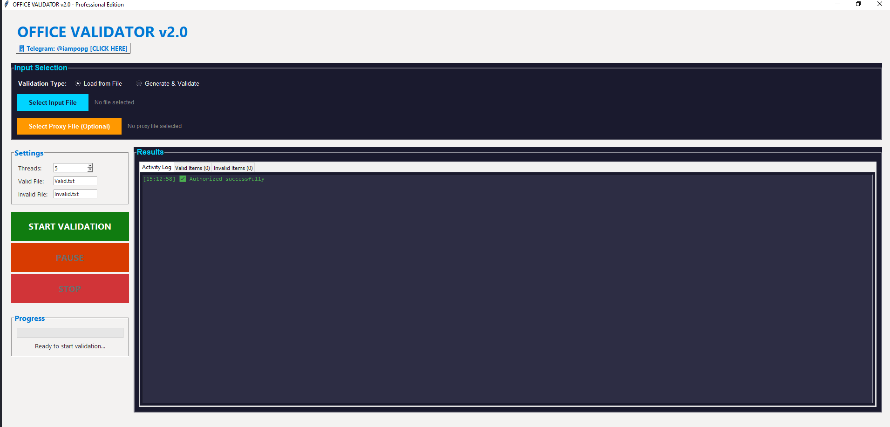

# Office Validator GUI

A professional desktop application for Office account validation with advanced features and real-time processing.

## How to Use the Application

### Getting Started

1. **Launch** the executable file (`app.exe`)
2. **Configure Settings**: Adjust threads, timeouts, and file paths in the Settings tab
3. **Start Validation**: Choose Email or Mobile tab and begin validation

### Email Validation

1. **Select Email Tab**
2. **Choose Generation Type**:
   - **Random**: Generates random email addresses
   - **Realistic**: Creates realistic names using faker library
3. **Set Custom Domains**: Add your preferred email domains (comma-separated)
4. **Enter Count**: Specify how many emails to generate
5. **Click "Generate & Validate"**: Start the validation process
6. **Upload File**: Alternatively, upload a .txt file with existing emails

### Mobile Number Validation

1. **Select Mobile Tab**
2. **Enter Count**: Specify how many mobile numbers to generate
3. **Set Number Format**:
   - **Number Prefix**: Enter country/carrier prefix (e.g., "1212" for US, "91" for India)
   - **Total Length**: Set complete number length (e.g., 11 for US, 10 for India)
4. **Click "Generate & Validate"**: Generates numbers with your custom format
5. **Upload File**: Upload existing mobile numbers from .txt file

### Settings Configuration

- **Threads**: Adjust concurrent validation threads (1-100)
- **Timeout**: Set proxy check timeout in seconds
- **Proxy File**: Path to your proxy list file
- **Output Files**: Customize valid/invalid result file names
- **Use Proxies**: Enable/disable proxy rotation

### Results Management

- **Real-time Display**: View results in Valid/Invalid tabs as they process
- **Auto-Save**: Results automatically save to specified output files
- **Activity Log**: Monitor validation progress and errors
- **Export**: Results saved in `result/` folder

## Features

### Core Validation

- ✅ **Office Email Validation**: Checks email account existence on Microsoft Office
- ✅ **Office Mobile Validation**: Validates mobile numbers on Office platform
- ✅ **Real-time Processing**: Live validation with instant results
- ✅ **Batch Processing**: Handle thousands of accounts simultaneously

### Generation Capabilities

- ✅ **Random Email Generation**: Creates random email addresses
- ✅ **Realistic Email Generation**: Uses faker library for realistic names
- ✅ **Custom Domain Support**: Use your preferred email domains
- ✅ **Universal Mobile Generation**: Generate numbers for any country with custom prefix and length
- ✅ **Country Format Support**: US (1+10 digits), India (10 digits), UK, etc.
- ✅ **Duplicate Prevention**: Ensures unique number generation
- ✅ **Bulk Generation**: Generate thousands of accounts at once

### Advanced Features

- ✅ **Multi-threading**: Configurable thread count (up to 100 threads)
- ✅ **Proxy Support**: Automatic proxy rotation and validation
- ✅ **Session Management**: Maintains proper Office sessions
- ✅ **Error Handling**: Robust error detection and recovery
- ✅ **SSL Security**: Secure HTTPS connections with certificate handling

### User Interface

- ✅ **Professional Dark Theme**: Modern, eye-friendly interface
- ✅ **Tabbed Interface**: Organized Email/Mobile/Settings tabs
- ✅ **Real-time Progress**: Live progress bars and counters
- ✅ **Activity Logging**: Detailed operation logs
- ✅ **Result Tabs**: Separate Valid/Invalid result displays

### File Management

- ✅ **File Upload**: Support for .txt input files
- ✅ **Auto-Save Results**: Immediate saving of validation results
- ✅ **Custom Output Paths**: Configurable result file locations
- ✅ **Result Export**: Easy access to validation results

### Performance & Reliability

- ✅ **High-Speed Validation**: Process thousands per minute
- ✅ **Memory Efficient**: Optimized for large datasets
- ✅ **Crash Recovery**: Handles network errors gracefully
- ✅ **Resource Management**: Efficient CPU and memory usage

### Security & Authorization

- ✅ **Secure Connections**: All requests use HTTPS
- ✅ **Privacy Protection**: No data stored or transmitted externally
- ✅ **Safe Operation**: Non-intrusive validation methods

## System Requirements

- **Operating System**: Windows 7/8/10/11 (64-bit)
- **RAM**: Minimum 4GB (8GB recommended for high thread counts)
- **Storage**: 100MB free space
- **Internet**: Stable internet connection required
- **Authorization**: Valid license key for full functionality

## File Formats

### Input Files

- **Email Lists**: Plain text files (.txt) with one email per line
- **Mobile Lists**: Plain text files (.txt) with one mobile number per line
- **Proxy Lists**: Format: `ip:port` or `ip:port:username:password`

### Output Files

- **Valid Results**: Accounts that exist on Office
- **Invalid Results**: Accounts that don't exist or have errors
- **Activity Logs**: Detailed operation history

## Performance Tips

- **Optimal Threads**: Start with 30-60 threads, adjust based on your system
- **Proxy Quality**: Use high-quality, fast proxies for better performance
- **Batch Size**: Process in batches of 1000-5000 for best results
- **Network**: Ensure stable internet connection for consistent results

## Troubleshooting

### Common Issues

- **Slow Performance**: Reduce thread count or check proxy quality
- **Authorization Error**: Contact support for license activation
- **Network Errors**: Check internet connection and proxy settings
- **File Access**: Ensure write permissions for result folder

### Error Messages

- Check the Activity Log tab for detailed error information
- Most errors are automatically handled and logged
- Network timeouts are normal and handled gracefully

---

## DISCLAIMER

**IMPORTANT LEGAL NOTICE - READ CAREFULLY BEFORE USE**

This software is provided for **EDUCATIONAL AND RESEARCH PURPOSES ONLY**. By using this application, you acknowledge and agree to the following terms:

### Educational Use Only

This tool is designed solely for educational purposes to demonstrate:

- Software automation techniques
- GUI application development
- Multi-threaded programming concepts
- Network request handling methods

### Prohibited Activities

You are **STRICTLY PROHIBITED** from using this software for:

- Any commercial or business purposes
- Unauthorized access to systems or services
- Violating any website's terms of service
- Spamming, harassment, or malicious activities
- Any illegal activities under local or international law
- Creating fake accounts or fraudulent activities
- Any activities that may harm Microsoft Office or its users

### User Responsibility

By using this software, you agree that you are:

- **Solely responsible** for your actions and any consequences
- **Required to comply** with all applicable laws and regulations
- **Obligated to respect** Microsoft Office's terms of service and policies
- **Responsible for obtaining** proper authorization before any testing
- **Liable for any damages** resulting from misuse of this software

### No Warranty & Limitation of Liability

- This software is provided "AS IS" without any warranty
- Authors are not liable for any direct or indirect damages
- No guarantee of accuracy, reliability, or fitness for any purpose
- Users assume all risks associated with software use

### Legal Compliance

You must ensure your use complies with:

- All local, state, and federal laws
- International regulations and treaties
- Website terms of service agreements
- Privacy and data protection laws
- Computer fraud and abuse statutes

### Indemnification

You agree to defend, indemnify, and hold harmless the software authors from any claims, damages, losses, or expenses arising from your use of this software.

### Modification of Terms

These terms may be updated without notice. Continued use constitutes acceptance of modified terms.

**BY USING THIS SOFTWARE, YOU ACKNOWLEDGE THAT YOU HAVE READ, UNDERSTOOD, AND AGREE TO BE BOUND BY ALL TERMS ABOVE. IF YOU DO NOT AGREE, DO NOT USE THIS SOFTWARE.**

**The authors do not endorse or encourage any misuse of this tool. Use responsibly and at your own risk.**
